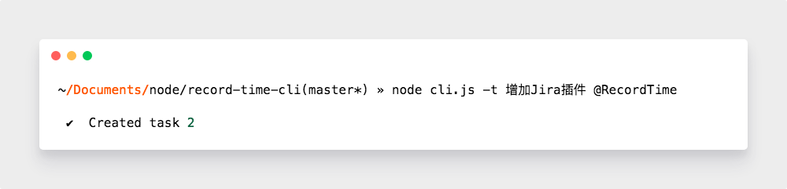

# RecordTime Cli

`Time Tracker`，简单来说就是「番茄钟」+「Todo」。

## Usage

### install

```bash
sudo npm i -g record-time-cli
```

之后的命令`node ./cli.js`都使用`rt`替代。

### create task



### show tasks


### start work


```bash
node cli.js --doing
```

### log


### auto rest


### complete task


### working


## Interface

### Task

为了同步，给每个`task`一个`from`字段

```js
{
  from: {
    0: 'cli',
    1: 'web',
    2: 'platform',
    3: 'mobile',
  }
}
```

## 多用户

虽然理论上来说只应该有一个用户，但是如果就是喜欢多个账号呢？

## Plugins

支持插件，比如创建任务时，向指定的地址`post`创建好的任务。

### init

在初始化前调用，可对`options`进行处理，一般在这个时候添加额外的命令。

### beforeApply

如果在`init`增加了命令，需要在这个地方响应对应的命令。

## 目录

每次执行命令，都会检查一些目录，如果不存在，就创建。

### ~/.recordtime

应用根目录，所有文件都是存放在该文件下。
通过变量`core._storage._mainAppDir`获取。

### ~/.recordtime/storage

存放了一个`storage.json`文件，内容为所有的任务。

### ~/.recordtime/archive

暂时不知道有啥用。

### ~/.recordtime/.temp

临时文件夹，每次新建任务前，都是先创建一个临时文件，再将临时文件重命名为`storage.json`。

### ~/.recordtime/archive/archive.json

### ~/.recordtime/storage/storage.json